## 🌐 Live Demo
[Netlify](https://squallerq-performance.netlify.app/)

## 🖥️ Screenshot

## Performance Report

### Before Optimization

- **Search**:
  - Commit Duration: 2.5s
  - Render Duration (CountriesTable): 28.9ms
  - Screenshot Flame: 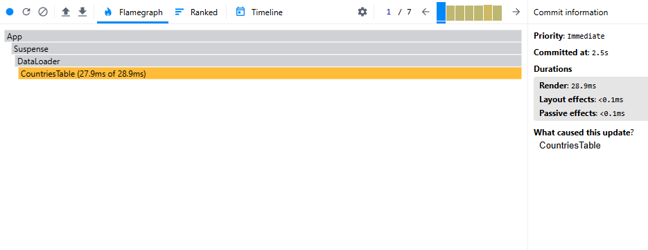
  - Screenshot Ranked: 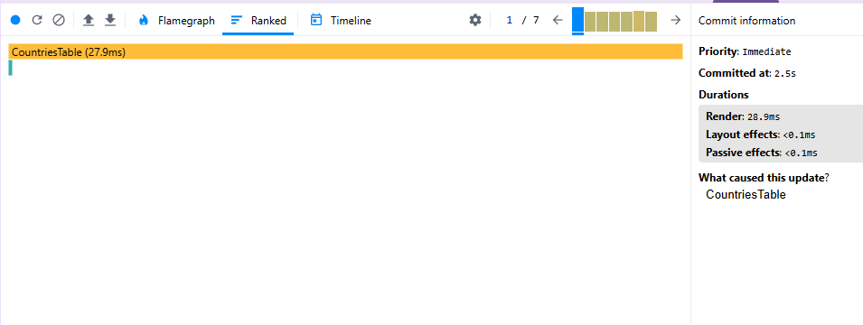
  - Screenshot: 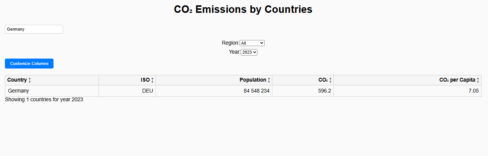

- **Year Change**:
  - Commit Duration: 6.7s
  - Render Duration (CountriesTable): 99ms
  - Screenshot Flame: 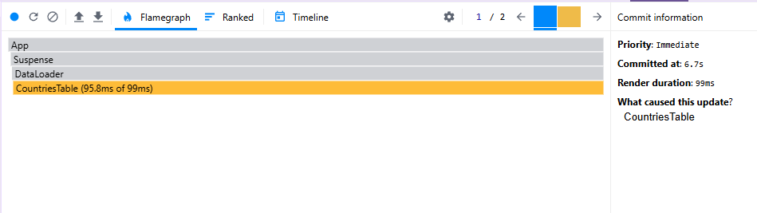
  - Screenshot Ranked: 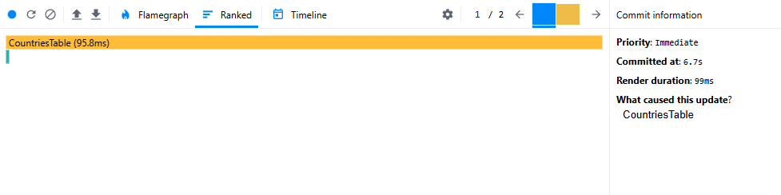
  - Screenshot: 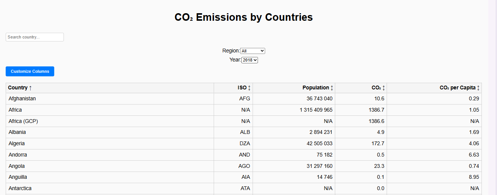

- **Sorting (Column)**:
  - Commit Duration: 1s
  - Render Duration (CountriesTable): 102ms
  - Screenshot Flame: 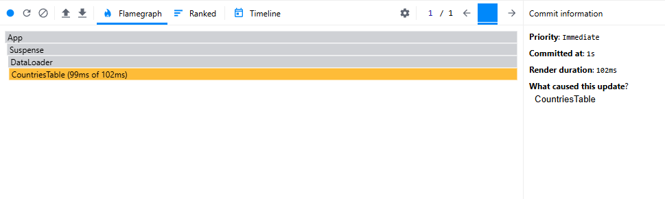
  - Screenshot Ranked: 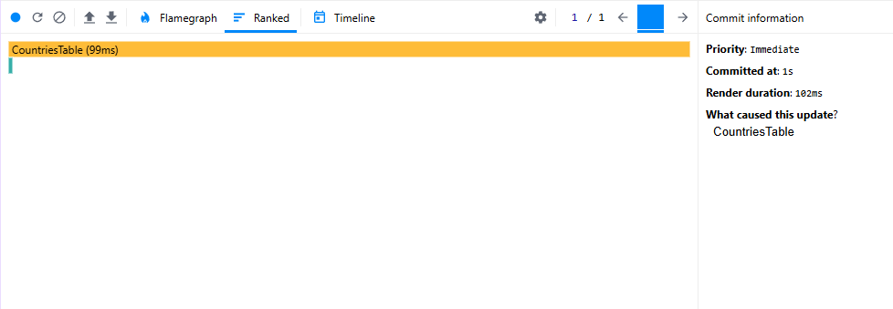
  - Screenshot: 

### After Optimization

- **Search**:
  - Commit Duration: 1.8s
  - Render Duration (CountriesTable): 16.7ms
  - Screenshot Flame: 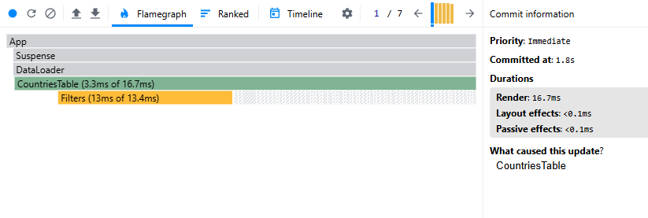
  - Screenshot Ranked: 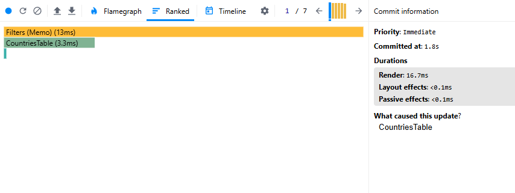
  - Screenshot: 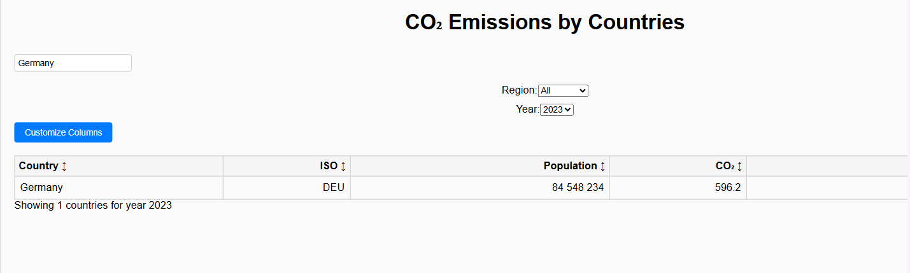

- **Year Change**:
  - Commit Duration: 1.6s
  - Render Duration (CountriesTable): 108.4ms
  - Screenshot Flame: 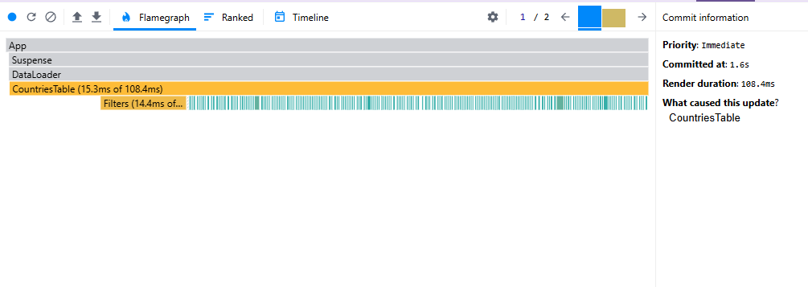
  - Screenshot Ranked: 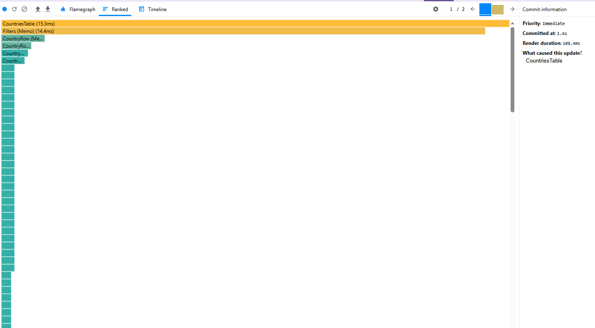
  - Screenshot: 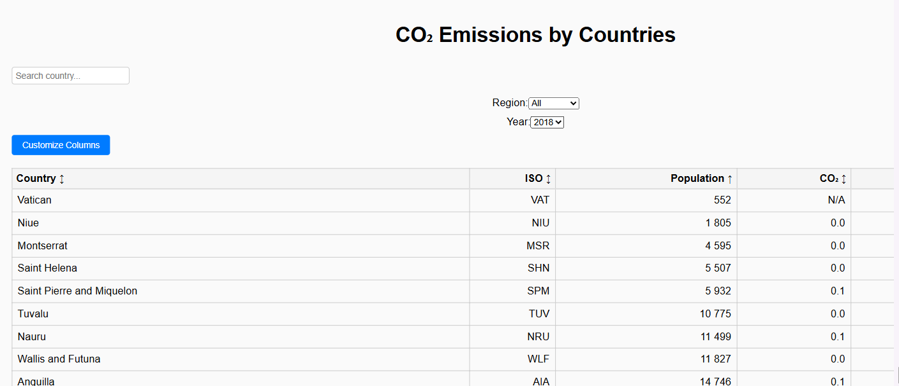
  - Full Screenshot: 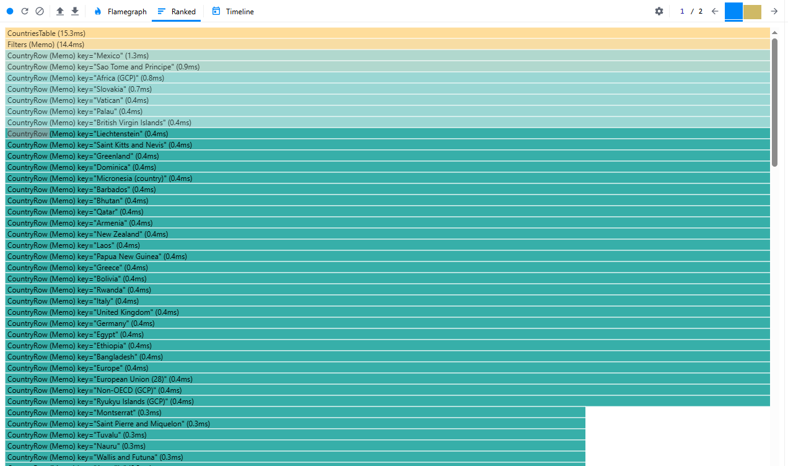

- **Sorting (Column)**:
  - Commit Duration: 1.5s
  - Render Duration (CountriesTable): 10.9ms
  - Screenshot Flame: 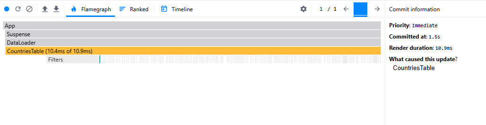
  - Screenshot Ranked: 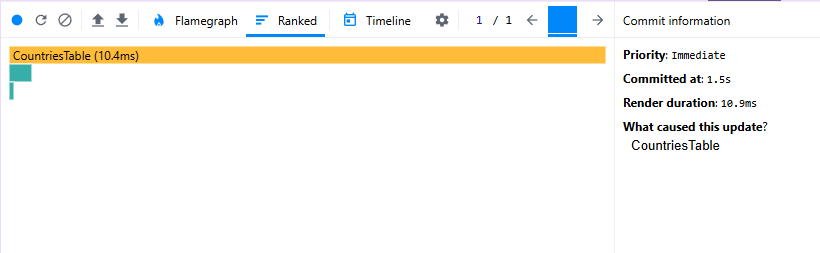
  - Screenshot: 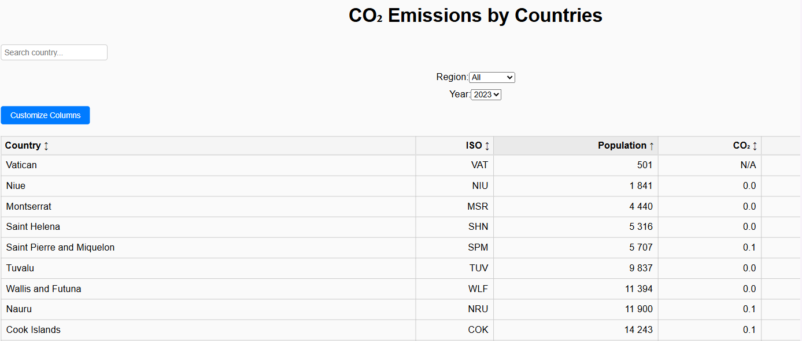
