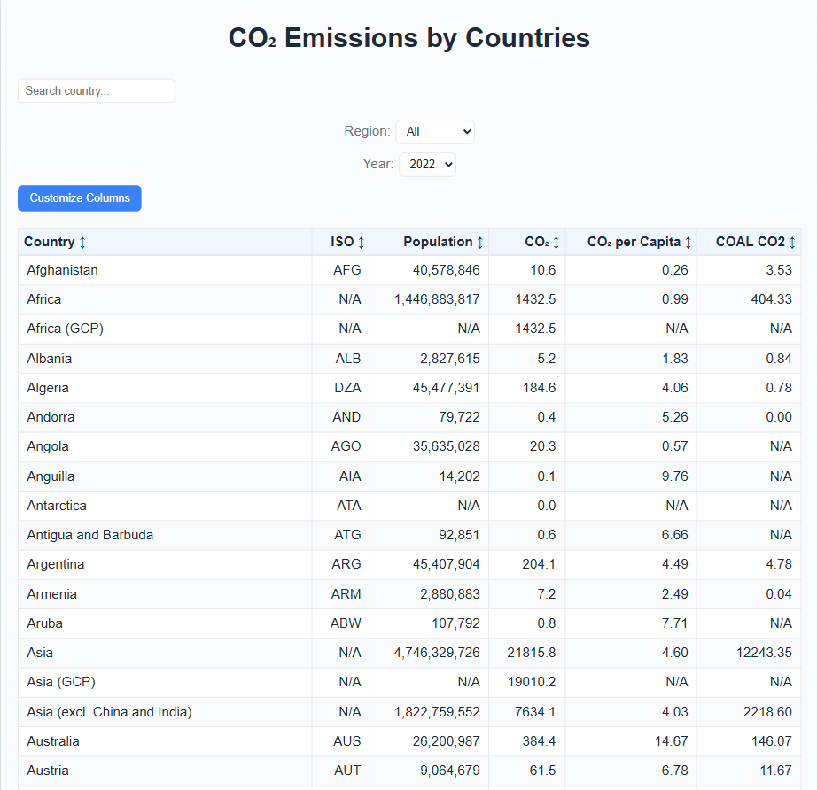

# React RSS Projects

Educational assignments completed as part of the [Rolling Scopes School](https://rs.school/) React course.

## 1. Forms (`forms` branch)

## 🌐 Live Demo

[Netlify](https://squallerq-forms.netlify.app/)

## 🖥️ Screenshot


Implementation and comparison of different form handling approaches in React.

**Features:**

- React Hook Form implementation with validation
- Uncontrolled form with refs and manual validation
- Form state management and error handling
- Real-time validation feedback

---

### 2. Performance (`performance` branch)

## 🌐 Live Demo

[Netlify](https://squallerq-performance.netlify.app/)

## 🖥️ Screenshot



Advanced React performance optimization techniques applied to a CO₂ emissions data table.

**Key Optimizations:**

- React.memo for component memoization
- useMemo and useCallback for expensive computations
- React Suspense with custom caching
- Optimized rendering of large datasets (200+ countries)

**Features:**

- Interactive sortable data table
- Dynamic column selection
- Real-time search and filtering
- Year-over-year comparison with highlighting

---

## Run Locally

1. Clone the repository:

```bash
   git clone https://github.com/SquallerQ/react-rss-projects.git
```

2. Navigate to the project directory:

```bash
   cd react-rss-projects
```

3. Switch to the desired branch:

```bash
   git checkout forms
   # or
   git checkout performance
```

4. Install dependencies:

```bash
   npm install
```

5. Start the development server:

```bash
   npm run dev
```

6. Open the app in your browser

---
